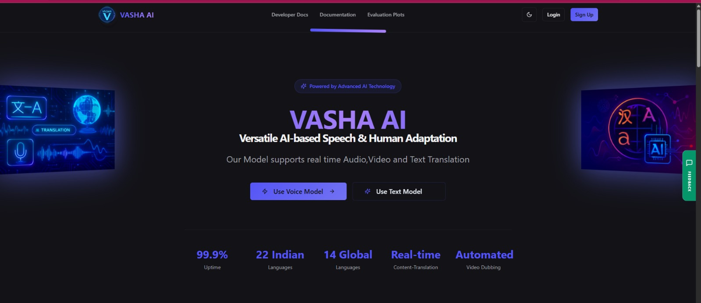
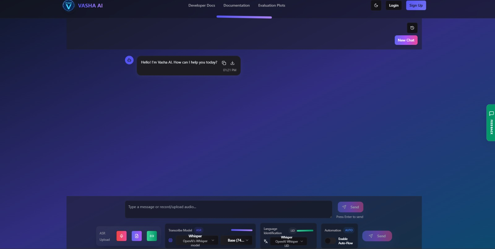

### Vasha Website – Multilingual ASR, MT & TTS Web App

> **🔗 Main Repository**: This production web application is built on top of the core [Vasha-AI models repository](https://github.com/deephabiswashi/Vasha-AI), which contains the ASR, LID, MT, and TTS models and pipeline implementations.

This project is the **web application** for Vasha AI: an end‑to‑end pipeline that converts **speech → text → translation → speech** with authentication and user-facing docs. It pairs a **React + Vite + TypeScript** frontend with a **FastAPI + Python** backend for ASR, machine translation, text‑to‑speech, and secure user management.

### 1. Website Screenshots

#### Homepage


The homepage showcases the landing page of Vasha AI, featuring the hero section with key features, language support information, and navigation to different sections of the application. It provides an intuitive interface for users to understand the capabilities of the real-time speech-to-speech translation system.

#### Chat Page


The chat page is the core interaction interface where users can upload audio files, record from their microphone, or provide YouTube URLs for speech recognition. It displays real-time transcription results, detected language information, model selection options, and provides seamless navigation to the machine translation and text-to-speech workflows.

### 2. Workflow Visualization

Understanding the end-to-end pipeline through visual guides:

#### Step 1: Voice Input & Processing

*The flow from user audio input to automatic speech recognition (ASR).*

#### Step 2: Text Translation

*The machine translation interface where recognized text is converted to the target language.*

#### Step 3: Audio Generation

*The synthesis pipeline using TTS models to generate spoken output.*

### 3. Architecture Overview

- **Frontend (`frontend/`)**
  - Vite + React + TypeScript, Tailwind CSS, shadcn-ui components
  - Main pages in `src/pages/`:
    - `Index` (landing/hero), `Chat` (ASR + chat), `MT` (machine translation), `TTS` (text‑to‑speech)
    - `UserDocs` (user manual), `DevDocs` (developer profiles/resources), `NotFound`
  - Service layer in `src/services/`:
    - `asrService.ts` → calls `/languages`, `/asr/models`, `/asr/upload`, `/asr/youtube`, `/asr/microphone`
    - `mtService.ts` → calls `/mt/translate`
    - `ttsService.ts` → calls `/tts/generate` and `/tts/audio/{filename}`
  - Auth UI (`src/components/auth/`) + `AuthContext` and Firebase config for OTP / captcha flows

- **Backend (`backend/`)**
  - `main.py` FastAPI application with:
    - User auth (signup + email OTP, SMS OTP, captcha login, Firebase phone verification, JWT tokens)
    - Chat history persistence with MongoDB
    - ASR, MT, and TTS REST endpoints
  - ASR / LID:
    - `asr_pipeline.py` (not shown here, used via `run_asr_with_fallback`)
    - `lid.py` for **language identification** based on Whisper or MMS LID (`TARGET_LANGS` covers 20+ Indic + global languages)
  - Machine Translation:
    - `mt.py` with Google Translate, IndicTrans2, and Meta NLLB‑200 + automatic fallback logic
  - Text‑to‑Speech:
    - `tts_handler.ts` + `indic_tts.py`, `tts_gtts.py`, `xtts.py` to combine **Indic Parler‑TTS**, **Coqui XTTS**, and **gTTS** with auto‑fallback
  - Additional docs in this folder (`ASR_README.md`, `AUTHENTICATION_FLOW.md`, cloud deployment guides)

### 4. Core User Features

- **ASR Chat (Speech → Text)**
  - Input options in `Chat` page:
    - Microphone recording via `AudioRecorder` (uploads `.webm`, backend converts to WAV)
    - File upload (`.wav`, `.mp3`, `.mp4`, `.mkv`, `.mov`, `.avi`, `.webm`)
    - YouTube URL download + processing
  - Automatic language detection (LID) using Whisper / MMS, restricted to supported `TARGET_LANGS`
  - Model controls:
    - ASR models: `whisper`, `faster_whisper`, `ai4bharat` (Indic Conformer with fallback to Whisper)
    - Whisper size and decoding strategy configuration
  - UI shows:
    - Detected language, model used, progress bars, errors, and a **post‑ASR “Continue to MT” flow**
  - Optional chat history persistence per user via `/chats` endpoints

- **Machine Translation (Text → Text)**
  - `MT` page takes ASR transcription (plus source audio if present)
  - Language selectors for **source** and **target**; model selector for:
    - `indictrans` (default), `google`, `nllb`
  - `mt.py`:
    - Sentence and chunk splitting for long text
    - Language‑code normalization between ISO, IndicTrans tags, and FLORES codes
    - Primary model + **automatic fallback** (e.g. IndicTrans → Google → IndicTrans)
  - Result can be copied and is passed directly to the TTS page.

- **Text‑to‑Speech (Text → Speech)**
  - `TTS` page receives translated text (and optionally original text) from MT
  - Model choices:
    - **Auto** (chooses Indic or XTTS or gTTS based on language)
    - **XTTS (Coqui)** for multilingual, voice‑cloned speech
    - **Indic Parler‑TTS** for high‑quality Indic voices
    - **gTTS** as universal fallback
  - `tts_handler.py`:
    - Safe token‑based text splitting for XTTS
    - Voice cloning support via reference WAV (e.g. `samples/female_clip.wav`)
    - Output written to `tts_output/` and served by `/tts/audio/{filename}`
  - Frontend provides audio playback and download.

- **Authentication & User Management**
  - Signup (`/signup`) → email OTP (`/complete-signup`) → welcome email
  - SMS OTP APIs: `/send-otp`, `/verify-otp`, `/resend-otp`
  - Captcha‑protected login: `/login-with-captcha`, `/verify-captcha`
  - Optional Firebase phone‑auth verification: `/verify-firebase-phone`
  - Authenticated `/me` and `/chats` endpoints for profile and history
  - Frontend components:
    - `AuthDialog`, `SignupForm`, `LoginForm`, `OtpVerificationModal`, `PhoneMfaModal`, `CaptchaField`

### 5. Project Directory Structure

```
vasha-website/
│
├── backend/                          # FastAPI Python backend
│   ├── main.py                       # Main FastAPI application with auth & API endpoints
│   ├── asr_pipeline.py              # ASR pipeline with Whisper/IndicConformer
│   ├── lid.py                        # Language identification module
│   ├── mt.py                         # Machine translation (Google/IndicTrans2/NLLB)
│   ├── tts_handler.py                # TTS orchestration handler
│   ├── indic_tts.py                  # Indic Parler-TTS implementation
│   ├── tts_gtts.py                   # Google TTS wrapper
│   ├── xtts.py                       # Coqui XTTS implementation
│   ├── setup_asr.py                  # ASR setup script
│   ├── requirements.txt              # Python dependencies
│   ├── samples/                      # Sample audio files for TTS voice cloning
│   │   └── female_clip.wav
│   ├── ASR_README.md                 # ASR module documentation
│   ├── AUTHENTICATION_FLOW.md        # Auth flow documentation
│   ├── AWS_DEPLOYMENT_GUIDE.md       # AWS deployment instructions
│   ├── AWS_SECURITY_GROUP_SETUP.md   # AWS security configuration
│   ├── DIGITALOCEAN_DEPLOYMENT.md    # DigitalOcean deployment guide
│   ├── FIREBASE_SETUP_GUIDE.md       # Firebase configuration
│   └── SMS_OTP_TESTING_GUIDE.md     # SMS OTP testing documentation
│
├── frontend/                         # React + Vite + TypeScript frontend
│   ├── src/
│   │   ├── pages/                    # Main application pages
│   │   │   ├── Index.tsx             # Landing/homepage
│   │   │   ├── Chat.tsx              # ASR chat interface
│   │   │   ├── MT.tsx                # Machine translation page
│   │   │   ├── TTS.tsx               # Text-to-speech page
│   │   │   ├── UserDocs.tsx          # User documentation
│   │   │   ├── DevDocs.tsx           # Developer documentation
│   │   │   └── NotFound.tsx          # 404 page
│   │   │
│   │   ├── components/               # React components
│   │   │   ├── auth/                 # Authentication components
│   │   │   │   ├── AuthDialog.tsx
│   │   │   │   ├── SignupForm.tsx
│   │   │   │   ├── LoginForm.tsx
│   │   │   │   ├── OtpVerificationModal.tsx
│   │   │   │   ├── PhoneMfaModal.tsx
│   │   │   │   ├── CaptchaField.tsx
│   │   │   │   ├── FirebasePhoneAuth.tsx
│   │   │   │   └── BackendPhoneAuth.tsx
│   │   │   │
│   │   │   ├── chat/                 # Chat/ASR components
│   │   │   │   ├── AudioRecorder.tsx
│   │   │   │   ├── AudioPlayer.tsx
│   │   │   │   ├── FileUpload.tsx
│   │   │   │   ├── LinkInput.tsx
│   │   │   │   ├── ModelSelector.tsx
│   │   │   │   ├── LanguageSelector.tsx
│   │   │   │   ├── LIDModelSelector.tsx
│   │   │   │   └── ChatHistory.tsx
│   │   │   │
│   │   │   ├── layout/               # Layout components
│   │   │   │   └── header.tsx
│   │   │   │
│   │   │   ├── sections/             # Page sections
│   │   │   │   ├── hero.tsx
│   │   │   │   ├── LanguageSupportTable.tsx
│   │   │   │   └── ModelDetailsModal.tsx
│   │   │   │
│   │   │   ├── ui/                   # shadcn-ui components (50+ files)
│   │   │   │   └── [button, card, dialog, input, etc.]
│   │   │   │
│   │   │   ├── MainPage.tsx
│   │   │   └── theme-provider.tsx
│   │   │
│   │   ├── services/                 # API service layer
│   │   │   ├── asrService.ts         # ASR API calls
│   │   │   ├── mtService.ts          # Machine translation API
│   │   │   ├── ttsService.ts         # Text-to-speech API
│   │   │   └── chatService.ts        # Chat history API
│   │   │
│   │   ├── context/                  # React context providers
│   │   │   └── AuthContext.tsx       # Authentication context
│   │   │
│   │   ├── config/                   # Configuration files
│   │   │   └── api.ts                # API base URL configuration
│   │   │
│   │   ├── lib/                      # Utility libraries
│   │   │   ├── firebase.ts           # Firebase configuration
│   │   │   └── utils.ts              # General utilities
│   │   │
│   │   ├── hooks/                    # Custom React hooks
│   │   │   ├── use-mobile.tsx
│   │   │   └── use-toast.ts
│   │   │
│   │   ├── App.tsx                   # Main app component
│   │   ├── App.css                   # App styles
│   │   ├── main.tsx                  # Entry point
│   │   ├── index.css                 # Global styles
│   │   └── vite-env.d.ts             # Vite type definitions
│   │
│   ├── public/                       # Static assets
│   │   ├── assets/
│   │   │   └── diagrams/             # Publicly accessible diagrams
│   │   ├── logo.png
│   │   ├── favicon.ico
│   │   ├── mainimage.png
│   │   ├── mainimage2.png
│   │   ├── asrlogo.png
│   │   ├── asrcombined.png
│   │   ├── mtlogo.png
│   │   ├── mt_combined.png
│   │   ├── ttslogo.png
│   │   ├── tts_mos.png
│   │   ├── tts_rtf.png
│   │   ├── asrvid.mp4
│   │   ├── mtvid.mp4
│   │   ├── ttsvid.mp4
│   │   ├── logovid.mp4
│   │   ├── placeholder.svg
│   │   └── robots.txt
│   │
│   ├── package.json                  # Node.js dependencies
│   ├── bun.lockb                     # Bun lockfile
│   ├── vite.config.ts                # Vite configuration
│   ├── tailwind.config.ts            # Tailwind CSS configuration
│   ├── tsconfig.json                 # TypeScript configuration
│   ├── components.json               # shadcn-ui components config
│   ├── eslint.config.js              # ESLint configuration
│   ├── index.html                    # HTML entry point
│   └── README.md                     # Frontend-specific README
│
├── diagrams/                         # Project diagrams and screenshots
│   ├── homepage.jpeg                 # Homepage screenshot
│   ├── chatpage.jpeg                 # Chat page screenshot
│   ├── Voice Translation.jpeg        # Input & ASR architecture
│   ├── Text Translation.jpeg         # Translation workflow
│   └── Audio Generation.jpeg         # TTS synthesis pipeline
│
├── .gitignore                        # Git ignore rules
├── package.json                      # Root package.json (if any)
├── README.md                         # This file
│
└── Documentation Files:
    ├── AUTOMATIC_LANGUAGE_DETECTION.md
    ├── AWS_DEPLOYMENT_QUICK_START.md
    ├── FRONTEND_BACKEND_CONNECTION.md
    └── VERCEL_FRONTEND_SETUP.md
```

### 6. Running the Web App (Dev)

- **Backend**
  - `cd backend`
  - Create venv + install: `python -m venv .venv` → activate → `pip install -r requirements.txt` or `python setup_asr.py`
  - Install external tools: **FFmpeg**, spaCy model (`python -m spacy download en_core_web_lg`), CUDA (optional)
  - Start: `uvicorn main:app --reload --host 0.0.0.0 --port 8000`

- **Frontend**
  - `cd frontend`
  - Install: `npm install` (or `bun install`)
  - Run dev: `npm run dev` (default `http://localhost:5173`)
  - Ensure `API_BASE_URL` in `src/config/api.ts` points to the backend (e.g. `http://localhost:8000`)

For deeper API details, environment variables, and deployment (AWS / DigitalOcean / Vercel / Firebase), refer to the markdown guides in this directory and the backend folder.